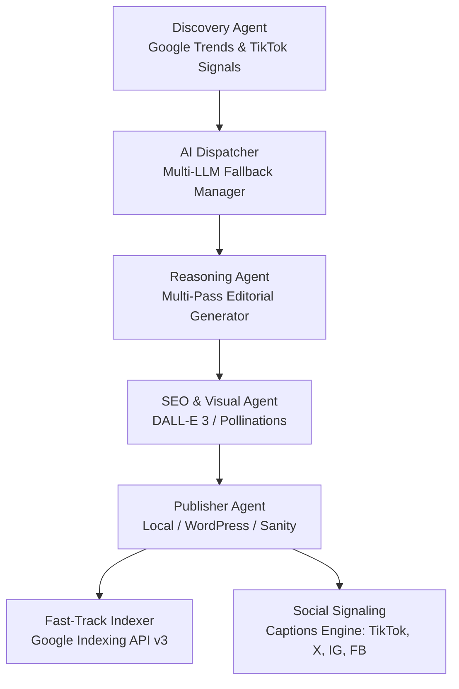

# ⚡ Niche Content Engine (Pulse)

[](https://github.com/Amrsono/Niche-Content-Engine/actions/workflows/ci.yml)
[](https://www.typescriptlang.org/)
[](https://nextjs.org/)
[](https://react.dev/)
[](https://vitest.dev/)
[](https://www.docker.com/)

> **Niche Content Engine** is an autonomous, AI-driven content generation, SEO optimization, and multi-platform social media distribution suite built on Next.js 16 and React 19.

---

## 🏗️ Architecture & Core Pipeline

The platform uses a coordinated multi-agent workflow that turns real-time trending signals into fully formatted editorial articles, social media assets, and fast-track indexed web pages:



### Key Capabilities
- **Multi-LLM Fallback Dispatcher**: Primary inference powered by **Groq** (`llama-3.3-70b-versatile` & `llama-3.1-8b-instant`), automatically falling back to **Google Gemini** (`gemini-2.0-flash`) and **OpenAI** (`gpt-4o-mini`) with exponential backoff and rate-limit cooldowns.
- **Fast-Track Google Indexing**: Bypasses slow Googlebot crawling by sending batch URL notifications directly via the Google Indexing API v3 using Service Account authentication.
- **Social Media Publishing**: Multi-platform distribution across TikTok (Direct Post API V2), X/Twitter (OAuth 1.0a + API v2), Instagram Graph API, and Facebook Pages.
- **Monetization Engine**: Automated contextual affiliate product injection (Amazon & SaaS partners) and Google AdSense ad slots.
- **Persistent Analytics**: View tracker, click-through rates, and aggregated analytics stored in Redis / filesystem fallback.

---

## 📁 Repository Structure

```
├── app/
│   ├── admin/indexing/         # Google Indexing dashboard (Quota bar, status badges)
│   ├── analytics/              # Revenue and traffic analytics view
│   ├── api/
│   │   ├── auth/tiktok/        # TikTok OAuth connect & callback handlers
│   │   ├── batch/              # Bulk autonomous generation endpoint
│   │   ├── cron/daily/         # Automated daily scheduled trigger
│   │   ├── health/             # System health & provider status check
│   │   ├── indexing/           # Fast-track Google Indexing API handler
│   │   ├── scraper/            # Autonomous single-keyword cycle runner
│   │   └── social/             # Individual social media signaling
│   ├── blog/                   # Public blog listing & dynamic article reader
│   ├── components/             # Reusable UI widgets & AdminGuard
│   ├── hooks/                  # Client custom hooks (useAdminGuard)
│   └── history/                # Generated post table with sorting & CTR analytics
├── lib/
│   ├── ai/
│   │   ├── providers/          # Groq, Gemini, and OpenAI modular clients
│   │   ├── dispatcher.ts       # Cooldown manager & fallback retry engine
│   │   ├── types.ts            # Strict AI & generation interfaces
│   │   └── utils.ts            # Safe JSON parsing & text cleaners
│   ├── social/captions.ts      # Multi-platform caption & hashtag generator
│   ├── tiktok/token.ts         # TikTok OAuth token refresh & buffer logic
│   ├── agents.ts               # Clean orchestrator (<350 LOC)
│   ├── env.ts                  # Zod environment variable validation
│   ├── validation.ts           # Zod API request schemas
│   ├── logger.ts               # Structured logger (info, warn, error, debug)
│   ├── sortPosts.ts            # Pure sorting, time filtering & CTR calculators
│   └── storage.ts              # Redis / filesystem post persistence
├── .github/
│   ├── workflows/ci.yml        # Hardened CI Pipeline (Lint, Typecheck, Test, Coverage, Audit, Build)
│   └── dependabot.yml          # Automated weekly dependency updates
├── Dockerfile                  # Production Alpine container
├── docker-compose.yml          # One-command app + Redis container stack
├── vitest.config.mjs           # Vitest unit & component test configuration with 70%+ coverage gate
└── SECURITY.md                 # Security policy & admin authorization model
```

---

## ⚙️ Environment Configuration

Copy the example environment configuration to `.env.local`:

```bash
cp .env.example .env.local
```

### Required & Optional Variables

| Variable | Required | Description |
| :--- | :--- | :--- |
| `GROQ_API_KEY` | **Yes** | Groq Cloud API key (primary LLM generation). |
| `GEMINI_API_KEY` | Optional | Google Gemini API key (secondary LLM fallback). |
| `OPENAI_API_KEY` | Optional | OpenAI API key (tertiary LLM & DALL-E 3 image generation). |
| `REDIS_URL` | Optional | Redis connection URI for persistent storage in production. |
| `GOOGLE_SERVICE_ACCOUNT_JSON` | Optional | Base64-encoded Google Cloud Service Account JSON for indexing. |
| `TIKTOK_CLIENT_KEY` / `SECRET` | Optional | TikTok Developer credentials for automated video/photo posts. |
| `INSTAGRAM_ACCESS_TOKEN` | Optional | Meta Graph API access token for Instagram publishing. |
| `TWITTER_API_KEY` / `SECRET` | Optional | Twitter API v2 + OAuth 1.0a credentials for X posts. |
| `FACEBOOK_PAGE_ACCESS_TOKEN` | Optional | Facebook Graph API access token for Page posting. |
| `NEXT_PUBLIC_ADMIN_EMAILS` | Optional | Comma-separated admin emails authorized for `/admin` routes. |
| `CRON_SECRET` | Optional | Bearer secret for securing automated daily cron triggers. |

---

## 🚀 Quick Start

### Option A: Local Development
```bash
# 1. Clone & Install
git clone https://github.com/Amrsono/Niche-Content-Engine.git
cd Niche-Content-Engine
npm install

# 2. Configure Environment
cp .env.example .env.local

# 3. Run Development Server
npm run dev
```

### Option B: Docker Compose (One-Command Startup)
```bash
# Build and start the app with isolated Redis service
docker compose up --build
```
Open [http://localhost:3000](http://localhost:3000) in your browser.

---

## 🧪 Testing & Verification

Niche Content Engine includes an automated test suite powered by **Vitest** and **React Testing Library** with an enforced 70%+ coverage gate:

```bash
# Run unit & component tests (130 specs)
npm test

# Run tests with code coverage report
npm run test:coverage

# TypeScript typecheck
npm run typecheck

# ESLint code cleanliness verification
npm run lint

# Production Next.js build
npm run build
```

---

## 🔒 Security & Admin Access

Administrative features (manual indexing triggers, model diagnostics, bulk cycles) are guarded by Clerk authentication and evaluated against `NEXT_PUBLIC_ADMIN_EMAILS`. For security policies and disclosure, see [SECURITY.md](SECURITY.md).

---

## 📄 License

MIT © [Amr Sono](https://github.com/Amrsono)
